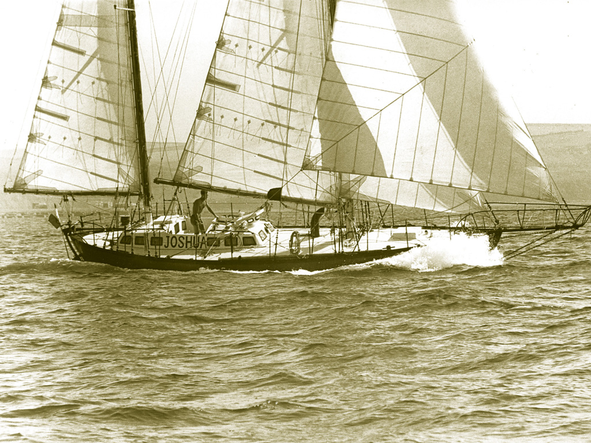

# A little insight about myself, the Magnificent Bruno* 🐧

###### *I'll talk about myself in the third person, just to give it a little more drama.

## Life, what a magnificent treasure. 👶

#### One hot summer afternoon, in the south of the world, Bruno the Magnificent showed his head in a beautiful hospital in a third world country. This country was Chile. 🇨🇱

## Adolescence, what strange memories. 🚀

#### Shortly after having filled his lungs for the first time with the city's smog, Bruno the Magnificent emigrated to Barcelona 🇪🇸 where he would make friends and learn to shave.

## Adulthood and other disasters. 💥

#### After having worked mainly in the maritime sector ⛵, Bruno the Magnificent decided to dedicate himself to teaching diving. This pleasant activity took 10 years of his life, but, as often happens, all good things usually come to an end.

#### In his mind and in his heart there was a concern, a concern that many of us suffer: 

```diff
- Economic Concern 💲❗
```


#### And well, that's why I'm in Germany learning to program. 💻

#### I am also a big fan of Bernard Moitessier. The first person to circle the world one and a half times alone without stopping.




